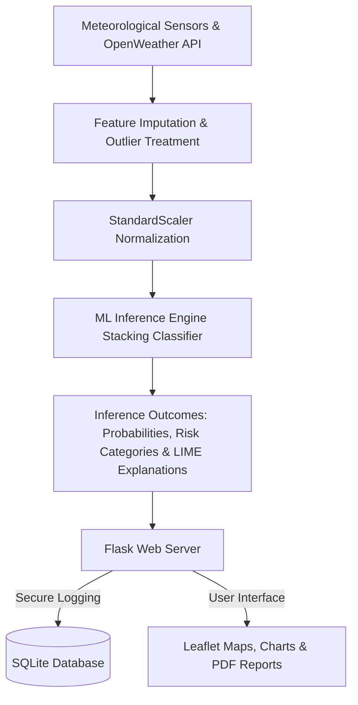

# Rising Waters: An Enterprise Machine Learning Platform for Flood Prediction

Rising Waters is an end-to-end, production-ready flood forecasting and telemetry management system. Combining an advanced data science pipeline with an interactive Flask web application, the platform implements **14 classification algorithms** (including boosting, voting, and stacking classifiers) to compute real-time and batch risk probabilities. 

This repository is designed to showcase enterprise software architecture suitable for Capstones, Placement Demonstrations, and Portfolios.

---

## 🏛️ System Architecture



### Core Architecture Components:
1. **Feature Pipeline** (`feature_engineering.py`): Performs outlier clipping via Interquartile Range (IQR) thresholds, imputes missing cells, and scales data.
2. **Model Evaluator** (`evaluate_models.py`): Trains and benchmarks 14 algorithms, exporting comparative ROC curves, Precision-Recall curves, learning curves, and PCA projections.
3. **API Routing** (`api.py`): Serves RESTful JSON endpoints for real-time predicting, batch execution, and analytics.
4. **Flask Controller** (`app.py`): Manages authentication, profile preferences, dynamic mapping, admin panels, and database log history.

---

## 💻 Technology Stack

- **Backend**: Python 3.11, Flask, SQLAlchemy (SQLite)
- **Frontend**: HTML5, CSS3, Bootstrap 5, Javascript, Jinja2
- **Data & ML**: Scikit-Learn, XGBoost, LightGBM, CatBoost, Pandas, NumPy, Joblib
- **Visuals**: Matplotlib, Seaborn, Chart.js, Leaflet.js (Geographic Maps)
- **Deployment & DevOps**: Docker, Gunicorn, Pytest, GitHub Actions

---

## 📁 Project Structure

```
FloodPrediction/
├── app.py                      # Flask core web server
├── config.py                   # Application settings & feature lists
├── requirements.txt            # Package dependencies
├── Procfile                    # WSGI deployment commands
├── runtime.txt                 # Specifies Python 3.11.9
├── Dockerfile                  # Container configurations
├── docker-compose.yml          # Container composer volume maps
├── train_model.py              # Orchestrator to generate data & train models
├── prediction.py               # Real-time predictor & LIME explainability
├── database.py                 # SQLAlchemy schemas (Users, Predictions, logs)
├── logger.py                   # Stream, file, and SQL log handlers
├── utils.py                    # PDF generator, Weather lookup, Backups
├── feature_engineering.py      # Imputation, outlier clipping, scaling
├── evaluate_models.py          # Trains 14 models & generates ROC/PCA plots
├── batch_predict.py            # Upload parser for CSV/Excel batch jobs
├── api.py                      # RESTful Blueprints endpoints
├── LICENSE                     # MIT License
├── .gitignore                  # VCS file exclusions
├── .env.example                # Template environment keys
├── dataset/
│   ├── raw/                    # Raw telemetry data (flood_raw.csv)
│   └── processed/              # scaled data (flood_processed.csv)
├── model/                      # Pickles (model, scaler, encoders)
├── templates/                  # Jinja2 HTML layout layouts
├── static/                     # Custom CSS, JS, and image plots
├── tests/                      # Pytest unit and integration suites
└── notebooks/                  # Jupyter research notebooks
```

---

## 🗄️ Dataset & Features

The model trains on **17 meteorological features** containing:
- **Rainfall**: `Annual_Rainfall` (mm), `Monthly_Rainfall` (mm)
- **Climate**: `Temperature` (°C), `Humidity` (%), `Pressure` (hPa), `Cloud_Cover` (%), `Wind_Speed` (km/h), `Visibility` (km)
- **Telemetry**: `River_Water_Level` (meters), `Ground_Water_Level` (meters)
- **Geography**: `Latitude`, `Longitude`
- **Seasonality**: `Season` ('Summer', 'Monsoon', 'Winter', 'Spring'), `Month` (Name)
- **Metadata**: `District`, `State` (used for reporting and filters)

---

## 🤖 Algorithms Used & Best Model Selection

The training script automatically compares 14 classifiers:
1. **Logistic Regression**
2. **K-Nearest Neighbors (KNN)**
3. **Naive Bayes (Gaussian)**
4. **Decision Tree**
5. **Random Forest**
6. **Support Vector Machine (SVM)**
7. **Gradient Boosting**
8. **AdaBoost**
9. **Extra Trees Classifier**
10. **XGBoost Classifier**
11. **LightGBM Classifier**
12. **CatBoost Classifier**
13. **Stacking Classifier** (Combining top 3 base estimators)
14. **Voting Classifier** (Soft probability consensus)

The pipeline automatically selects the best classifier based on **F1-score** and exports the fitted model binary to `model.pkl`.

---

## 🔌 REST API Documentation

The platform serves the following REST API endpoints:

### 1. `POST /api/predict`
Runs inference on a single record.
- **Request Body**:
```json
{
  "Annual_Rainfall": 2500, "Monthly_Rainfall": 350, "Temperature": 28.5,
  "Humidity": 82, "Pressure": 1009, "Cloud_Cover": 75, "Wind_Speed": 15.2,
  "River_Water_Level": 5.2, "Ground_Water_Level": 3.1, "Visibility": 8.0,
  "Latitude": 19.07, "Longitude": 72.87, "Season": "Monsoon", "Month": "July",
  "user_name": "API Client", "location": "Mumbai"
}
```
- **Response**:
```json
{
  "success": true,
  "prediction_id": 1,
  "prediction": 1,
  "probability": 85.3,
  "risk_level": "High",
  "confidence": 70.6,
  "explanation": { "River_Water_Level": 42.1, "Monthly_Rainfall": 25.3 }
}
```

### 2. `POST /api/batch_predict`
Expects form-data file upload (`file`) containing a CSV or Excel file. Returns download link to prediction report.

### 3. `GET /api/history`
Returns history logs listing past prediction IDs, risk levels, and date runs.

### 4. `GET /api/analytics`
Returns aggregate risk distribution counts and probability averages.

### 5. `GET /api/model_info`
Returns model training metrics comparison stats.

---

## ⚙️ Installation & Running Guide

### Step 1: Run Locally
1. Install Python packages:
   ```bash
   pip install -r requirements.txt
   ```
2. Execute data generation & model training:
   ```bash
   python train_model.py
   ```
3. Start the Flask web application:
   ```bash
   python app.py
   ```
   *Open `http://127.0.0.1:5000/` to explore the portal.*
4. Default Administrator login credentials:
   - **Username**: `admin`
   - **Password**: `admin123`

### Step 2: Run Tests
Execute pytests verifying model transformations and controller routing:
```bash
python -m pytest
```

### Step 3: Run via Docker
Launch using docker-compose:
```bash
docker-compose up --build
```

---

## 🔒 Security Practices
- **Password Hashing**: Implements secure `bcrypt` hashing configurations.
- **SQL Injection Prevention**: SQLite logs are handled via SQLAlchemy ORM parameters.
- **Session Protections**: Implements HttpOnly cookies.

---

## 📄 License
This project is licensed under the MIT License - see the [LICENSE](file:///c:/Users/jaswa/Desktop/rising%20water/LICENSE) file for details.

## ✍️ Author
**Rising Waters Environmental AI & Software Engineering Team**
